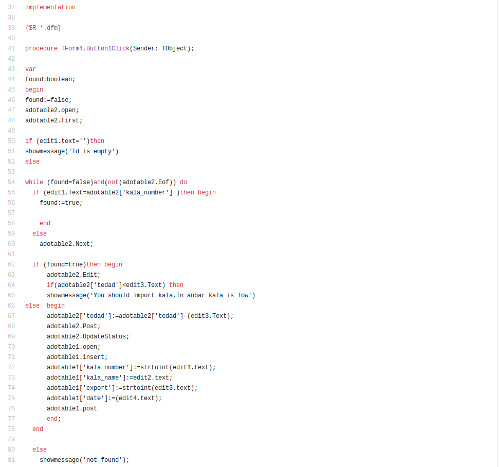

<div dir="rtl">

# انبارداری
## قدیمی‌ترین کدی که تونستم از خودم پیدا کنم

ترم دوم سال اولی که دانشگاه بودم یه درسی داشتیم به نام پروژه عملی که در اون استادی به نام شیری بهمون دلفی درس می‌داد. هم استاد به غایت تخمی بود هم دلفی. البته اون زمان نه. یه هیجانی داشت و من حتی تا دو سال بعد هم با دلفی کار می‌کردم
توو اون ترم یکی از دخترای همکلاسی ما مادرش مریض شد و نتونست درس بخونه برای امتحانات. هر کسی به نحوی کمکش کرد که حداقل مشروط نشه و قرار شد من هم این برنامه رو براش بنویسم

یک انبار که یه باید ورود و خروج و موجودی رو نگه می‌داشت. ازش هم گزارش تهیه می‌کرد و نشون میداد. ازش هیچ اسکرین‌شاتی ندارم که محیطش رو بشه دید. بعیده بشه الان هم اجراش کرد.
دیتابیس اون اکسس بود. اون زمان استاد ما هم چیزی بیشتر از این بلد نبود. چیزی که در اون ترم به ما درس داده شد جزو چرت‌ترین مباحثی بوده که به عمرم یاد گرفتم و کلا از زمانی که براش هدر دادم متاسفم.

چون این کد رو به خیلی‌ها داده بودم که ازش استفاده کنن و یاد بگیرن، مجبور شدم شهریور دوباره این کد رو عوض کنم براش تا بتونه تحویل بده. یادمه که  حتی به ترم بعد هم کشید. استاد کثافتی بود. هیچ جوره راه نمی‌اومد نمره بیشتر بده. آقای شیری هر جا هستی به قول خودتون تف ده ریت

کدی که نوشتم رو اینجا منتشر می‌کنم. 

این اسکرین‌شات گویای همه چیز است:
این بخشی از کد جستجو برای کالا است که دنبال کالا در دیتابیس می‌گرده فقط اون پیام خطایی که میده
 
 ```pascal
showmessage('You should import kala, In anbar kala is low') 
 ```

<p align="center"></p>

</div>
